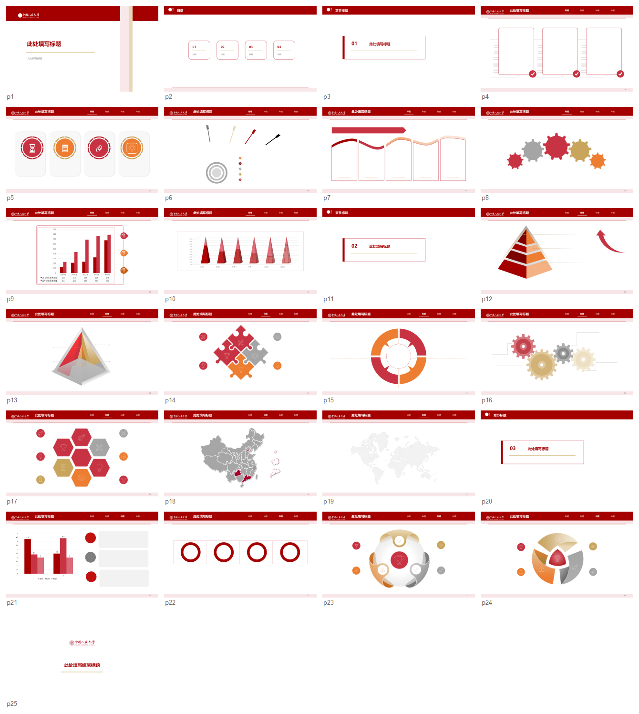

# University PPT Skill

面向大学生汇报、课程展示、论文答辩、竞赛路演和校园项目展示的可编辑 PPTX 生成 Skill 原型。

它的目标不是“在普通 PPT 上贴一个学校 logo”，而是把高校主题 PPT 拆解成一套可复用的产品化系统：学校视觉 token、封面/目录/章节/内容母版/结尾结构套件、信息关系版式库、主题迁移规则和视觉质量检查标准。

当前版本以红色系 logo 高校视觉为样本，沉淀了一套可迁移的主题 token 与版式规则；同一套版式结构可以迁移到蓝色系、绿色系等不同校色体系中，迁移时尽量只替换颜色、logo、校名和图片资产，保持版式几何结构稳定。



## Product Idea

市面上的高校 PPT 模板大多停留在“换校徽、换校名、换几张校园图”的层面，但用户真正需要的是：

- 一眼能识别学校气质的视觉系统。
- 覆盖真实汇报场景的复杂版式，而不是几个简单圆圈和方块。
- 可以继续编辑的 `.pptx`，而不是整页截图。
- 颜色、logo、图片、页眉页脚、章节导引保持统一。
- 换到另一所学校时，版式不重新设计，只做主题迁移。

这个项目把这些需求拆成一套可持续扩展的 Skill 架构，让“高校主题 PPT 生成”从单个模板文件变成可复用的版式与主题系统。

## Core Capabilities

- 生成可编辑 `.pptx` 文件，保留 PowerPoint 中的文本框、形状、图表和可调整版式。
- 提供结构套件：封面页、目录页、章节页、内容页母版、结尾页可以作为一套统一风格使用。
- 提供内容版式库：要点卡片、图文案例、流程、时间线、层级金字塔、对比分析、数据图表、循环关系、空间地图、团队介绍、图标素材等。
- 使用学校主题 token 管理主色、深色、浅色、灰色、中性色和少量点缀色。
- 支持主题迁移：保持版式位置和结构不变，只替换主色体系、logo、学校名称和可选校园图片。
- 内置质量规则，避免 logo 拉伸、默认 Office 蓝绿橙残留、来源模板文字残留、过多无意义文本框、非主题色泄漏等问题。

## User Workflow

理想使用方式是用户只需要提出目标，例如：

> 帮我做一份某大学主题的课程汇报 PPT。

Skill 的工作流会拆成四步：

1. 识别学校：检查主题库中是否已有该学校的视觉 token、logo 和可用图片资产。
2. 选择结构：根据用途选择封面/目录/章节/内容母版/结尾结构套件。
3. 组装内容：从信息关系版式库中选择适合的内容页，如流程、对比、图文、时间线、图表等。
4. 视觉校验：检查主题色、logo 比例、占位文字、页面比例和不该残留的模板信息。

如果学校不在主题库中，Skill 会提示用户补充学校 logo、标准色、学校中英文名称、可用校园图片或禁用图片的要求。

## Theme Model

主题迁移不是简单的查找替换颜色，而是把颜色位置抽象成 token：

```text
primary        主色：学校最具识别度的颜色
primaryDark    深主色：标题条、重点形状、深色背景
primary75      中深色：分层、强调、图表高亮
primary25      浅色：浅背景、辅助块、弱强调区域
neutralText    正文文字色
neutralLine    边框线和弱分割线
neutralFill    卡片、底纹、浅灰辅助区域
accentSoft     少量协调点缀色
```

红色系、蓝色系、绿色系学校都使用同一套 token 位置。这样做的好处是：版式库只需要设计一次，换学校时可以稳定迁移，而不会出现红色模板强行改蓝后仍残留红色、绿色、橙色等问题。

## Repository Contents

```text
skill/university-ppt/
  SKILL.md
  references/
  scripts/
  assets/
    library_index.json
    schools/
examples/
  preview_contact_sheet.png
docs/
```

仓库主分支保留 Skill 源文件、脚本、规则文档、主题 token、预览图和项目说明。完整可编辑 PPTX 模板库体积较大，放在 GitHub Release 中：

[Download full PPTX template library](https://github.com/SiyuQiannn/university-ppt-skill/releases/latest/download/university-ppt-skill-repo.zip)

Release ZIP 中包含项目当前生成的完整模板资产：

- 结构套件：封面、目录、章节、内容母版、结尾。
- 内容版式库：多个信息关系类型的可编辑 PPTX。
- 样例 deck：用于验证主题、结构套件和内容版式组合效果。
- 预览图：用于快速检查页面视觉质量。
- 校验输出：用于定位颜色、比例、占位符等问题。

## Quick Start

Requirements:

- Windows
- Microsoft PowerPoint desktop app
- PowerShell

1. 下载 Release 中的完整模板包并解压。
2. 在项目根目录运行资源检查：

```powershell
powershell -NoProfile -ExecutionPolicy Bypass -File .\skill\university-ppt\scripts\check_assets.ps1 -SkillRoot .\skill\university-ppt
```

3. 生成一份样例 deck：

```powershell
powershell -NoProfile -ExecutionPolicy Bypass -File .\skill\university-ppt\scripts\assemble_ruc_sample_deck.ps1 -OutputDir .\outputs\sample_deck
```

The script exports:

- a sample editable `.pptx` deck
- preview PNG images
- a contact sheet for quick visual review
- a validation CSV for QA checks

## Design Principles

- PPT 必须可编辑，不能把整页做成不可编辑截图。
- 结构边框属于结构套件和内容页母版，内容版式页只负责中间的信息结构。
- 内容页版式尽量减少无意义文本框，只保留和结构强相关的必要占位。
- 占位文字必须通用，例如 `标题`、`副标题`、`此处填写文字`，不能残留来源模板、网站、作者或具体主题信息。
- 所有字体统一使用微软雅黑，字号需要和版式密度匹配。
- logo 和图片必须保持原始纵横比，不能被横向或纵向拉伸。
- 主题迁移时保持几何结构稳定，只替换颜色、logo、校名和图片资产。
- 迁移到蓝色系、绿色系等主题时，不能残留原主题大面积主色；点缀色必须克制并与新主色协调。
- 默认 Office 主题色需要清理，避免出现未设计过的蓝色、绿色、橙色。

## Current Status

Prototype, locally verified on 2026-06-21.

当前版本已经验证：

- 可生成可编辑 PPTX。
- 可组合结构套件和内容版式。
- 可在不同主色体系之间迁移。
- 可导出预览图和视觉检查结果。
- 可将完整模板库作为 Release 资产交付。

## Roadmap

- 将样例组装脚本升级为 `deck_spec.json` 驱动的通用组装器。
- 将学校迁移逻辑升级为 `brand.json` 驱动的通用主题迁移器。
- 扩充无图片封面、目录、章节、结尾结构套件。
- 为每一种主要信息关系补充 2-3 个复杂度不同的版式变体。
- 增加自动视觉检查：主题色泄漏、logo 拉伸、占位文字残留、页面比例错位、文本框过密。
- 增加学校资产录入流程：用户提供 logo、标准色、校名和图片后自动生成学校主题包。
- 增加面向真实用户提问的工作流，让用户可以从一句自然语言需求生成完整 PPT。

## Notes

This is a portfolio/work-in-progress repository. The layout assets in the release package are included so the project can be reviewed directly. Real school logos and campus imagery should be verified or replaced before broad redistribution.
