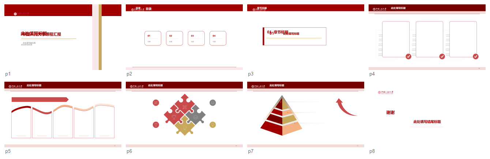

# Usage Simulation

This document records one realistic end-to-end use of the University PPT Skill.

## Simulated User Conversation

User:

> 帮我做一套中国人民大学主题的课程汇报 PPT，8 页，尽量不用图片。

Skill:

> 我会先检查学校主题库。中国人民大学已经在库中，包含红色系主题 token、logo 变体和版式资产。因为你说“尽量不用图片”，我会选择 no-photo 结构套件，并用通用占位文字，不编造课程内容。

Skill internal workflow:

1. Mode: `new_deck`.
2. School: `ruc`.
3. Purpose: `course_report`.
4. Image preference: `minimal`.
5. Create `deck_spec.json`.
6. Validate spec strictly.
7. Assemble editable PPTX.
8. Export slide previews and a contact sheet.
9. Keep full PPTX editable, not flattened into images.

## Commands Used

Run from `skill/university-ppt`:

```powershell
powershell -NoProfile -ExecutionPolicy Bypass -File .\scripts\new_deck_spec.ps1 -SkillRoot . -SchoolId ruc -Purpose course_report -TargetSlideCount 8 -Title "中国人民大学课程汇报" -Subtitle "此处填写副标题" -OutputPath .\_assembly_smoke_output\demo\deck_spec.json

powershell -NoProfile -ExecutionPolicy Bypass -File .\scripts\validate_deck_spec.ps1 -SkillRoot . -SpecPath .\_assembly_smoke_output\demo\deck_spec.json -Strict

powershell -NoProfile -ExecutionPolicy Bypass -File .\scripts\assemble_deck.ps1 -SkillRoot . -SpecPath .\_assembly_smoke_output\demo\deck_spec.json -OutputDir .\_assembly_smoke_output\demo\assembled
```

## Generated Output

The generated demo is included in `examples/`:

- `examples/spec_driven_demo_deck_spec.json`
- `examples/spec_driven_demo_deck.pptx`
- `examples/spec_driven_demo_contact_sheet.png`

Preview:



## What The PPT Looks Like

The demo deck has 8 pages:

1. Cover page: red university-theme structure, school logo, report title, subtitle placeholder.
2. Table of contents: four chapter cards.
3. Section page: chapter transition with red band and gold divider.
4. Content page: three-card checklist/card layout.
5. Content page: process/flow layout.
6. Content page: comparison/network-style layout.
7. Content page: hierarchy/pyramid layout.
8. Ending page: thank-you page with school identity.

The content pages use the structure suite for top/bottom chrome and keep the center-area layout editable. Text is generic placeholder copy, so users can fill in real content without fighting old template text.

## Blue Theme Migration Check

The same assembler was also run with a blue-theme school token set. The output kept the same geometry and changed the primary theme from red to blue. A red logo residue found on the ending page was fixed by making no-photo structure pages remove source-template images before adding the target school logo.

This confirms the core migration rule:

```text
same geometry + same information structure + replaced theme tokens/logo/school identity
```

## Current Boundary

The skill can now create a validated spec and assemble a real editable PPTX from bundled structure and content assets. The next quality step is to add deeper automated visual checks, such as detecting old school logo residues by image comparison rather than relying on preview review.
